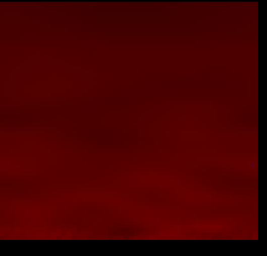
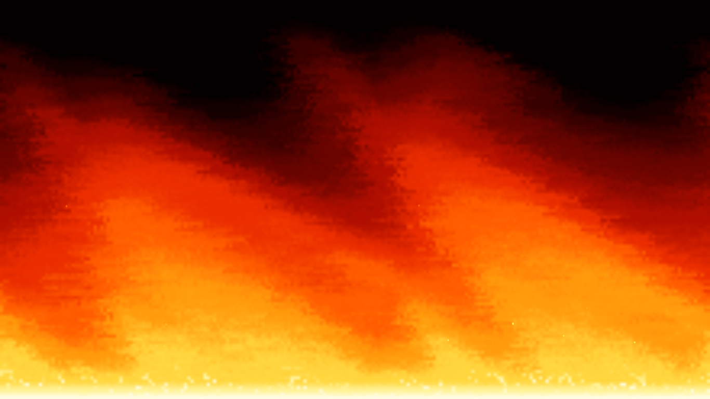

# 🔥 Fire Animation

A lightweight **procedural fullscreen fire background** built with Vanilla JavaScript and HTML5 Canvas.

The project started as a small fire-propagation experiment and has now evolved into a reusable, responsive **Living Fire Background** designed for demos, landing pages, games, portfolios, and other web experiences.

## Preview

### V1 — Original Version



The original version used a fixed-size canvas and a small numeric grid. Each heat cell was rendered as an individual red rectangle, which made the effect strongly pixel-based and visually limited to mostly dark-red tones.

### V2 — Current Version



V2 rebuilds the effect as a fullscreen procedural fire wall with a richer heat palette, organic flame tongues, turbulence, embers, responsive sizing, adaptive internal resolution, and a power-conscious rendering pipeline. The current performance pass keeps the same visual concept while substantially reducing sustained fullscreen work.

## V1 vs V2

| Feature | V1 | V2 |
|---|---|---|
| Rendering | Individual canvas rectangles | `ImageData` pixel buffer + scaled canvas rendering |
| Heat storage | Standard JavaScript array | `Uint8Array` double buffer |
| Resolution | Fixed 1000 × 800 canvas / 50 × 70 simulation | Responsive adaptive simulation grid |
| Fire colors | Mostly red | Burgundy → red → orange → gold → yellow → near-white |
| Flame movement | Basic vertical propagation | Wind, turbulent drift, cooling, diffusion and coherent flame tongues |
| Fullscreen | CSS-stretched fixed canvas | Native viewport-aware fullscreen canvas |
| Embers | No | Yes, with a small reusable particle pool |
| Mobile | Limited | Responsive portrait and landscape support |
| Display resolution | Fixed canvas | Power-conscious backing store that avoids unnecessary high-DPI fullscreen rendering |
| Hidden tab behavior | Keeps the animation lifecycle active | Pauses with the Page Visibility API |
| Reduced motion | No | Reduced FPS, turbulence and ember density |
| Resize handling | Fixed dimensions | Debounced rebuild on viewport/orientation changes |
| Reuse in other projects | Limited | Exposed `window.FireBackground` controller |
| Build step | None | None |

## What's New in V2

- Completely redesigned procedural fire simulation.
- Fullscreen fire generated across the entire lower edge of the viewport.
- Multiple flame heights and naturally shifting flame tongues.
- Rich heat-based color lookup palette with near-white hot cores.
- Typed-array double buffering for predictable memory usage.
- `ImageData` rendering instead of thousands of `rect()` / `fill()` calls.
- Adaptive internal simulation resolution instead of simulating every display pixel.
- Gentle global wind plus local turbulent drift.
- Lightweight rising embers with a strict particle limit.
- Power-conscious canvas backing resolution instead of blindly following high device pixel ratios.
- 48 FPS default animation target with time-based motion, preserving animation speed while reducing sustained work.
- Precomputed spatial wave tables to remove expensive trigonometry from the per-cell hot loop.
- A single fullscreen compositing pass instead of drawing the entire fire texture twice per frame.
- Automatic quality adjustment when rendering cost rises.
- Page Visibility API support to stop work while the tab is hidden.
- `prefers-reduced-motion` support.
- Debounced resize/orientation handling.
- Reusable start, stop, resize and destroy methods.

## Performance

V1 drew each simulated cell separately with Canvas path operations. V2 instead keeps the heat field inside two reusable `Uint8Array` buffers. The current frame is converted to pixels through a precomputed heat palette and a single reusable `ImageData` object.

The current performance pass goes further: the simulation grid is smaller, the fullscreen backing surface is intentionally rendered below CSS resolution and smoothly upscaled, and high-DPI displays no longer multiply the canvas workload unnecessarily. This is especially important for a fullscreen animated background, where the number of display pixels can cost more than the fire simulation itself.

The hottest simulation loop no longer performs repeated `Math.sin()` calls for every cell. Spatial sine/cosine values are precomputed when the grid is built, while each frame only updates a small set of phase values. Noise-table access is also performed locally inside the loop to reduce function-call overhead.

The previous extra additive fullscreen draw was removed, so each rendered frame now uses one opaque fire-texture draw instead of two large compositing passes. The default target is 48 FPS; motion remains time-based, so flame speed is preserved while sustained CPU/GPU work is reduced.

The project still uses adaptive quality, a strict ember limit, one `requestAnimationFrame` lifecycle, debounced resize handling, Page Visibility pausing, and reduced-motion support.

### V2 performance pass

- Lower simulation-cell budget while preserving smooth scaling.
- Lower fullscreen backing resolution for large displays.
- No automatic multiplication by high device pixel ratio.
- 48 FPS power-conscious default target.
- Precomputed wave tables instead of per-cell trigonometry.
- Local noise-table reads in the simulation hot loop.
- One fullscreen compositing pass instead of two.
- Fixed-size performance sample buffers instead of continuous array `push()` / `shift()` churn.
- Adaptive quality considers both JavaScript work time and real animation-frame cadence.

## Responsive Design

The canvas follows the actual viewport instead of stretching a fixed 1000 × 800 surface. The internal grid is rebuilt after a debounced resize and adapts to desktop, tablet, portrait mobile, and landscape mobile aspect ratios.

The visual canvas still fills the viewport, but its internal backing resolution is intentionally capped below full CSS resolution when appropriate. This keeps large monitors and high-DPI devices from spending unnecessary CPU/GPU time on pixels that do not materially improve a soft procedural fire texture.

## Using It as a Background

The default page contains only the canvas, so it can be placed behind normal page content.

```html
<canvas id="fireCanvas" aria-hidden="true"></canvas>
<main class="content">
  <!-- Your project content -->
</main>
<script src="./script.js"></script>
```

The running instance is exposed as `window.FireBackground`:

```js
FireBackground.stop();
FireBackground.start();
FireBackground.resize(true);
```

You can therefore integrate the effect into another static project without adding a framework or build system.

## Run Locally

Clone the repository:

```bash
git clone https://github.com/GustavoVitorS/Fire-animation.git
cd Fire-animation
```

Because the project is static, you can open `index.html` directly in a browser. You can also serve it locally:

```bash
python3 -m http.server 8000
```

Then open `http://localhost:8000`.

## GitHub Pages

No build step, package manager, or server-side runtime is required. The repository can be published directly through GitHub Pages.

## Technologies

- HTML5
- CSS3
- Vanilla JavaScript
- HTML5 Canvas API
- `ImageData`
- Typed Arrays
- `requestAnimationFrame`
- Page Visibility API
- `prefers-reduced-motion`

## Project Evolution

**V1** was a compact experiment in cellular fire propagation. **V2** keeps that procedural spirit while turning the idea into a reusable fullscreen background engine with significantly richer graphics, modern browser lifecycle handling, responsive sizing, and a much more efficient rendering architecture.
